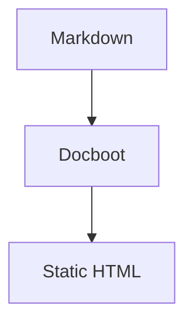

# Docboot

> **Ultra-fast, zero-config, lightweight Markdown documentation generator with local client search, zero-latency soft SPA navigation, GitHub Pages setup, Mermaid diagrams, rich primitives, and modern developer aesthetics.**

`docboot` transforms any directory of Markdown files into a modern, static, SEO-ready documentation website with instant local preview and sub-second incremental builds.

---

## ⚡ Quick Start

```bash
# Start dev server instantly on current directory
npx docboot .

# Start dev server on ./docs folder and open browser
npx docboot ./docs -o

# Build static production site to ./dist
npx docboot build

# Preview static production build locally
npx docboot serve

# Validate documentation health (broken links, images, routes)
npx docboot doctor

# Prepare GitHub Actions for GitHub Pages deployment
npx docboot setup github

# Inspect documentation metrics & bundle sizes
npx docboot stats

# Generate production assets (favicon, OG social banner, PWA manifest)
npx docboot generate assets
```

---

## 🚀 CLI Commands & Flags

### Commands

| Command | Description |
| :--- | :--- |
| `docboot init [dir]` | Scaffolds starter `docboot.config.js` and starter documentation files |
| `docboot init config` | Generates only `docboot.config.js` with TypeScript/JSDoc types |
| `docboot [dir]` | Discovers Markdown files, builds, and starts dev server with SSE live reload |
| `docboot dev [dir]` | Explicit dev server mode |
| `docboot build [dir]` | Compiles static HTML, assets, and search index to `dist/` |
| `docboot serve [dir]` | Serves the production `dist/` directory locally |
| `docboot doctor [dir]` | Validates broken internal links, anchors, images, duplicate routes, and frontmatter health |
| `docboot setup [github]` | Configures GitHub Actions workflow (`.github/workflows/docs.yml`) for GitHub Pages |
| `docboot stats [dir]` | Inspects documentation word/page counts, build times, and bundle sizes |
| `docboot clean [dir]` | Clears the local incremental build cache directory (`.docboot/`) |
| `docboot generate [assets]` | Generates production assets (SVG favicon, OG banner, PWA web manifest) |

### Flags

| Flag | Long Flag | Description |
| :--- | :--- | :--- |
| `-b` | `--build` | Build static site |
| `-s` | `--serve` | Serve static production build |
| `-o` | `--open` | Open site in default browser |
| `-p <port>`| `--port <port>` | Custom port (default: `3000`) |
| `-c` | `--clean` | Clean cache and output folder before build |
| | `--no-cache` | Bypass reading and writing build cache |
| | `--dry-run` | Preview setup actions without modifying files |
| `-f` | `--force` | Overwrite existing files when allowed |
| | `--github` | Include GitHub Pages health checks in `docboot doctor` |
| `-q` | `--quiet` | Mute non-error console output |
| `-v` | `--verbose` | Enable verbose error logging |
| | `--pwa` | Generate PWA manifest and offline support |
| `-h` | `--help` | Display help menu |
| | `--version` | Display version |

### Combined Flags

Short flags can be combined naturally:

```bash
docboot . -bo      # Build + open browser
docboot . -so      # Serve + open browser
docboot . -bc      # Clean build
```

---

## 🐙 GitHub Pages Deployment (`docboot setup github`)

Prepare your documentation project for automated deployment to GitHub Pages via official GitHub Actions without requiring personal access tokens, GitHub API access, or remote CLI mutations:

```bash
docboot setup github

git add .
git commit -m "add docs workflow"
git push
```

### Features:
- **Automatic Detection**: Remote URL $\rightarrow$ `owner/repository`, default branch (`main`), package manager (`npm`, `pnpm`, `yarn`, `bun`), and Node.js version.
- **Base Path Inference**: Normal repos default to `/repository/`; user/org pages (`owner.github.io`) and custom domains default to `/`.
- **Workflow Generation**: Creates `.github/workflows/docs.yml` using official GitHub Actions (`actions/checkout@v4`, `actions/setup-node@v4`, `actions/upload-pages-artifact@v3`, `actions/deploy-pages@v4`).
- **Doctor Diagnostic Integration**: Check deployment readiness with `docboot doctor --github`.
- **Dry-Run & Overwrite Protection**: Preview with `--dry-run` and protect custom workflows without `--force`.

---

## 📁 File Structure & Routing Convention

Zero-config automatic router discovers Markdown files and preserves folder hierarchy:

```text
docs/
├── README.md               -> /
├── 01-getting-started.md   -> /getting-started
├── guide/
│   ├── 01-installation.md  -> /guide/installation
│   └── 02-state.md         -> /guide/state
└── api/
    └── runtime.md          -> /api/runtime
```

1. **Clean SEO-friendly routes** (`/`, `/getting-started`, `/guide/installation`, `/guide/state`, `/api/runtime`).
2. **Numeric prefix stripping**: `01-getting-started.md` produces `/getting-started` while preserving natural sort order.
3. **Automatic Category Hubs**: Intermediate folders without `index.md` automatically get modern card grid index pages.
4. **Hierarchical collapsible sidebar**.
5. **Interactive breadcrumbs with in-page text size stepper**.
6. **Next and previous document pagination links**.
7. **Heading slug permalinks (`#`) with table-of-contents scroll spy**.
8. **Instant SPA Navigation with Top Loading Bar**: Zero-latency page transitions with background link prefetching and an animated top progress bar.

---

## 🔗 Automatic Internal Link Resolution

Relative file links (`.md` / `.markdown`) written in your Markdown files are automatically transformed into clean web routes at build time:

| Markdown Link | Resolved Web Route |
| :--- | :--- |
| `[Installation](./installation.md)` | `/getting-started/installation` |
| `[Architecture](../concepts/architecture.md#c4)` | `/concepts/architecture#c4` |
| `[Home](../README.md)` | `/` |
| `[Guide](/guide/README.md)` | `/guide` |
| `[State](./state.md#computed)` | `/guide/state#computed` |
| `[GitHub](https://github.com/...)` | External links remain untouched (`target="_blank"`) |

---

## 🧩 Rich Documentation Primitives

Build richer technical documentation without needing React, JSX, or complex setups:

### Accessible Tabs & Synced Groups (`:::tabs`)

```markdown
:::tabs group="package-manager"
::tab npm
```bash
npm install docboot
```
::tab pnpm
```bash
pnpm add docboot
```
:::
```

### Code Groups (`:::code-group`)

```markdown
:::code-group
```js [JavaScript]
export const port = 3000;
```
```ts [TypeScript]
export const port: number = 3000;
```
:::
```

### Collapsible Details (`:::details`)

```markdown
:::details Advanced Configuration
Detailed configuration options go here.
:::
```

### Custom Text Size Directives

```markdown
::: lead
This is an introductory lead paragraph styled with larger typography.
:::

::: text-sm
Fine print or smaller auxiliary notes.
:::
```

### Safe Embeds (`:::embed`)

```markdown
:::embed youtube
src: https://youtube.com/watch?v=dQw4w9WgXcQ
title: Walkthrough Video
ratio: 16/9
:::
```

### Image Lightbox & Galleries (`:::gallery`)

```markdown
:::gallery
- src: ./screens/home.png
  alt: Home screen
  caption: Main dashboard

- src: ./screens/search.png
  alt: Search
  caption: Instant search modal
:::
```

---

## 📄 Frontmatter & Source Code Integration

Add YAML frontmatter to control page metadata, sorting, and source code links:

```yaml
---
title: State Management
description: Reactive state architecture
order: 3
source: "src/core/state.js"
draft: false
---
```

When `source` is provided in frontmatter (or `editLink` / `sourceLink` in configuration), Docboot renders:
- An interactive **`⌥ Source: path/to/file ↗`** badge at the top of the article.
- **`Edit this page on GitHub ✎`** and **`View source ⌥`** action links in the page footer.

---

## 🎨 Themes, Color Presets & Typography

Docboot provides a complete reader customization system with zero-flicker anti-flash loading:

- **3 Theme Modes**: `light`, `dark`, `system` (instant 1-click toggle).
- **6 Color Presets**:
  - 🔘 **Zinc** (Default): Minimalist & clean UI (Tailwind & Linear style)
  - 🌊 **Ocean**: Deep navy & cyan indigo
  - 🌲 **Emerald**: Slate & vibrant mint green (Supabase / Mintlify style)
  - 🔮 **Violet**: Neon purple & amethyst (Vite / Nuxt style)
  - ☀️ **Amber**: Warm obsidian & amber gold (Rust / Astro / Claude style)
  - 🌹 **Rose**: Modern ruby & coral pink
- **Dynamic Font Size Scaling (3 Levels)**:
  - Header & Breadcrumb stepper: `[A- 100% A+]`
  - Right sidebar TOC stepper
  - Settings palette dropdown selector (`Small`, `Medium`, `Large`, `Extra Large`)
- **Font Family Selector**:
  - **Sans (`Inter`)**: Modern & clean technical font
  - **Outfit (`Outfit / Plus Jakarta`)**: Modern geometric display
  - **Serif (`Editorial`)**: Long-form article reading mode
  - **Sys (`Native System`)**: OS native typography (SF Pro, Segoe UI, Ubuntu)

---

## 💻 Code Blocks & Mermaid Diagrams

- **15+ Languages Supported**: Fast build-time Prism syntax highlighting.
- **Mac Terminal Header**: macOS window controls (red/yellow/green), title/filename, and language badge (e.g. ````js title="server.js"````).
- **One-Click Copy**: Animated copy button with instant visual feedback.
- **Interactive Mermaid Diagrams**: Responsive diagrams with auto dark/light theme switching and a **Large Modal View** supporting interactive SVG pan & zoom.

````markdown

````

---

## 🔍 Local Client-Side Search (MiniSearch & Cmd + K)

Documentation search runs entirely client-side with zero latency powered by **MiniSearch**:

- **Zero External Dependencies & Network Requests**: No Algolia or external search backend required.
- **Section-Level Deep Indexing**: Granular search results with direct heading (`#section`) permalinks.
- **Intelligent Search Engine**: Exact matching, prefix search, fuzzy matching / typo tolerance, and ranking.
- **Weighted Boosting**: `title` (5), `headings` (3), `section` (2), `text` (1).
- **Lazy Loading**: MiniSearch runtime and search index are loaded on-demand only when triggered via `Cmd + K`, `Ctrl + K`, or clicking search bar.
- **Keyboard Navigation**: Arrow Up / Down navigation, Enter to open, Esc to close.

---

## ⚙️ Configuration (`docboot.config.js`)

Zero-config by default. Create an optional `docboot.config.js` in your root directory to customize:

```javascript
// docboot.config.js
export default {
  title: "My Project Documentation",
  description: "High-performance documentation site",
  docs: "./docs",
  out: "./dist",
  repo: "https://github.com/your-org/my-project",
  editLink: {
    pattern: "https://github.com/your-org/my-project/edit/main/docs/:path"
  },
  sourceLink: {
    pattern: "https://github.com/your-org/my-project/blob/main/:path"
  },
  theme: {
    preset: "ocean",       // "zinc" | "ocean" | "emerald" | "violet" | "amber" | "rose"
    defaultMode: "system"  // "system" | "dark" | "light"
  },
  search: {
    fuzzy: 0.2,
    prefix: true,
    maxResults: 10,
    minQueryLength: 2
  },
  embeds: {
    allowedDomains: ["youtube.com", "codesandbox.io", "stackblitz.com"]
  }
};
```

---

## 📄 License

MIT © 2026 Docboot
