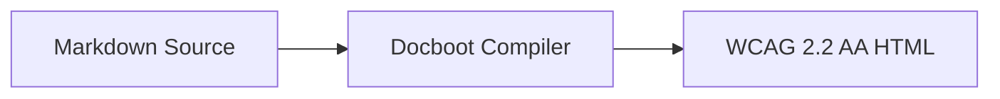

# Accessibility

Docboot is designed to generate **WCAG 2.2 AA-compliant** documentation out of the box, without requiring authors to become accessibility experts.

Accessibility is not an afterthought or an optional theme. It is built into the generated static HTML structure, keyboard navigation system, interactive rich content primitives, modal dialogs, and automated build-time diagnostics.

---

## Core Principles

Docboot adheres to four core accessibility rules:

1. **Never rely only on color to communicate meaning:**
   Callouts, status badges, search results, and active states use distinct iconography, borders, underlines, and text labels in addition to colors.
2. **Full keyboard navigability:**
   Every interactive element can be reached, focused, and operated using standard keyboard controls (`Tab`, `Shift+Tab`, `Arrow Keys`, `Enter`, `Space`, `Escape`).
3. **Screen reader live updates:**
   Dynamic events such as copying code, opening dialogs, and filtering search results announce polite status updates via an `aria-live="polite"` region.
4. **Resilience to user preferences:**
   Respects `prefers-reduced-motion: reduce`, `forced-colors: active` (Windows High Contrast), and custom system font sizes without breaking layouts.

---

## Semantic HTML & Landmarks

Every Docboot documentation page is structured with standard HTML5 semantic elements and ARIA landmark roles:

```html
<!-- 1. Accessible Skip Link -->
<a href="#main-content" class="docboot-skip-link">Skip to main content</a>

<!-- 2. Screen Reader Live Announcer -->
<div id="docboot-a11y-live" role="status" aria-live="polite" class="sr-only"></div>

<!-- 3. Header Landmark -->
<header role="banner"> ... </header>

<!-- 4. Navigation Landmarks -->
<nav aria-label="Main documentation navigation"> ... </nav>
<nav aria-label="Breadcrumb"> ... </nav>
<nav aria-label="On this page"> ... </nav>

<!-- 5. Main Content Landmark -->
<main id="main-content" role="main" tabindex="-1">
  <article role="article" class="prose"> ... </article>
</main>

<!-- 6. Footer Landmark -->
<footer role="contentinfo"> ... </footer>
```

### Skip to Main Content

Keyboard and screen reader users can press `Tab` upon landing on any page to immediately focus the **Skip to main content** link, bypassing the top navbar and jumping directly to `#main-content`.

---

## Keyboard Navigation

Docboot provides keyboard navigation across all interactive components:

| Component | Key | Behavior |
| :--- | :--- | :--- |
| **Global** | `Tab` / `Shift+Tab` | Navigate between focusable elements with visible focus rings |
| **Search** | `Cmd+K` or `/` | Open command palette search dialog |
| **Search** | `↑` / `↓` | Navigate through search results list |
| **Search** | `Enter` | Select and open the active search result |
| **Search** | `Esc` | Close search modal and restore focus to trigger |
| **Tabs** | `←` / `→` | Cycle between previous / next tabs |
| **Tabs** | `Home` / `End` | Jump to first / last tab in group |
| **Lightbox** | `←` / `→` | View previous / next image in gallery |
| **Modals** | `Esc` | Close modal dialog and restore focus |

### Focus Management & Trapping

All modal dialogs (Command Palette Search, Image Lightbox, and Mermaid Diagram Viewer) implement **focus trapping**:

* When a modal opens, the current active element is remembered and focus moves to the primary input or close button.
* Pressing `Tab` cycles exclusively through interactive controls within the open modal.
* Pressing `Escape` or closing the modal automatically restores keyboard focus to the button that opened it.

---

## Rich Content Semantics

### Accessible Tabs (`:::tabs`)

Tabbed code blocks and content containers follow the [WAI-ARIA Tabs Pattern](https://www.w3.org/WAI/ARIA/apg/patterns/tabs/):

* Container uses `role="tablist"` with `aria-label="Tabs"`.
* Active tab button has `role="tab" aria-selected="true" tabindex="0"`.
* Inactive tab buttons have `role="tab" aria-selected="false" tabindex="-1"`.
* Tab panels use `role="tabpanel" tabindex="0" aria-labelledby="{tabId}"`.

### Mermaid Diagram Fallback

Every rendered Mermaid diagram includes:

1. `role="figure"` and `aria-label="{Diagram Title}"` on the container.
2. A `<figcaption>` element describing the diagram.
3. An expandable textual source fallback (`<details class="docboot-mermaid-source">`) allowing screen reader users to view the underlying diagram definition:



### Copy Code with Live Feedback

When the user clicks **Copy** on any code snippet:

1. The button changes visually to `Copied!` with a green checkmark icon.
2. The screen reader live region (`#docboot-a11y-live`) politely announces: `"Code copied to clipboard"`.

---

## High Contrast & Reduced Motion

### High Contrast / Forced Colors

Docboot supports Windows High Contrast Mode and `@media (forced-colors: active)`:

* Focus rings render using system `Highlight` color.
* Active tabs and navigation items use `Highlight` borders.
* Callout containers enforce visible `CanvasText` left borders.

### Reduced Motion

When users enable reduced motion in their operating system (`prefers-reduced-motion: reduce`), all animations and smooth transitions are disabled to prevent motion sensitivity:

```css
@media (prefers-reduced-motion: reduce) {
  *, ::before, ::after {
    animation-duration: 0.01ms !important;
    animation-iteration-count: 1 !important;
    transition-duration: 0.01ms !important;
    scroll-behavior: auto !important;
  }
}
```

---

## Automated Accessibility Doctor

You can validate your documentation against WCAG 2.2 AA standards using the built-in Doctor command:

```bash
docboot doctor --a11y
```

### What Doctor Checks

* **Color Contrast Ratios:** Calculates relative luminance and verifies contrast ratios $\ge 4.5:1$ for normal text and $\ge 3.0:1$ for large text and UI components.
* **Missing Image Alt Attributes:** Flags any `` missing an `alt` description.
* **Heading Hierarchy Skips:** Warns if heading levels are skipped (e.g. jumping from `<h1>` directly to `<h3>`).
* **Iframe Titles:** Ensures all embedded `<iframe>` elements contain a descriptive `title` attribute for screen readers.
* **Tablist ARIA Markup:** Verifies that all tabbed sections implement valid ARIA roles and keyboard indexes.

### Example Doctor Output

```bash
$ docboot doctor --a11y

  DOCUMENTATION HEALTH CHECK

  ✔ 14 documentation pages discovered & parsed
  ✔ 48 internal links verified
  ✔ All routes deterministic and valid
  ✔ 14/14 pages pass semantic heading hierarchy validation
  ✔ 22/22 image descriptions verified (no empty alt text)
  ✔ All iframe embeds contain accessible title attributes
  ✔ All built-in theme color palettes satisfy WCAG 2.2 AA contrast ratios (>= 4.5:1)

  ✔ All health checks passed successfully with zero broken links!
```
