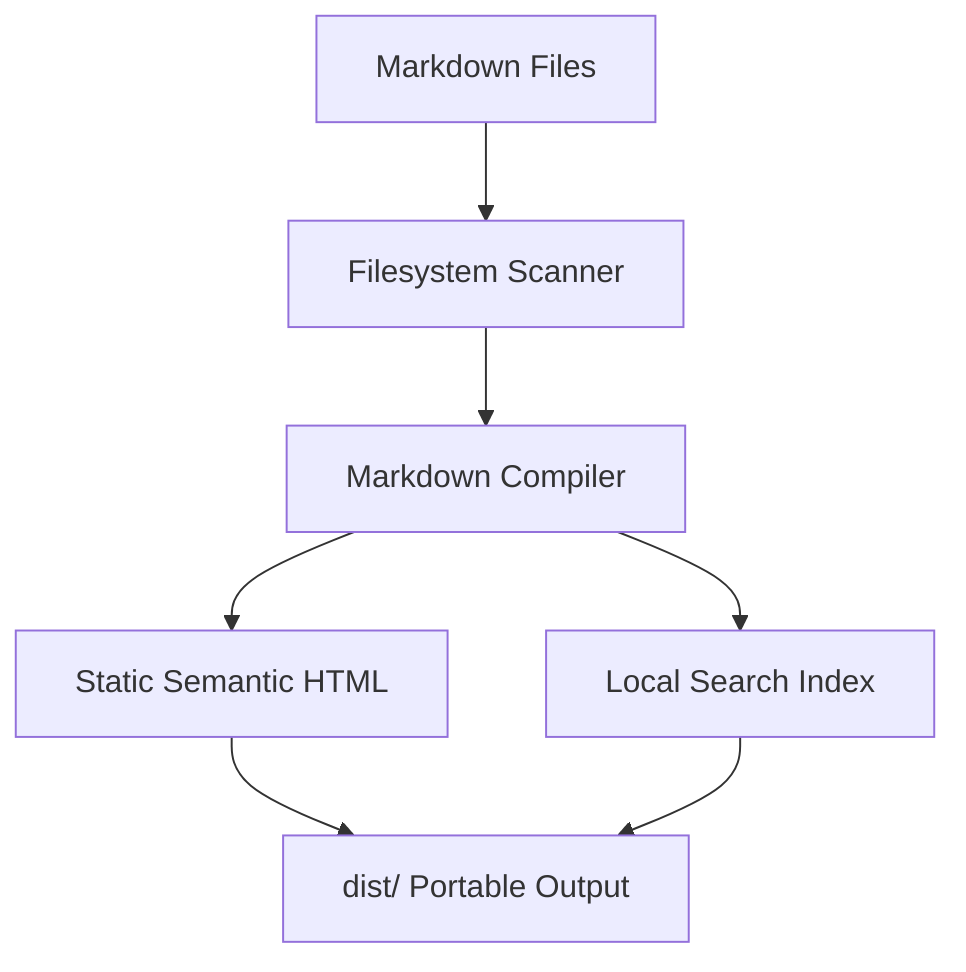
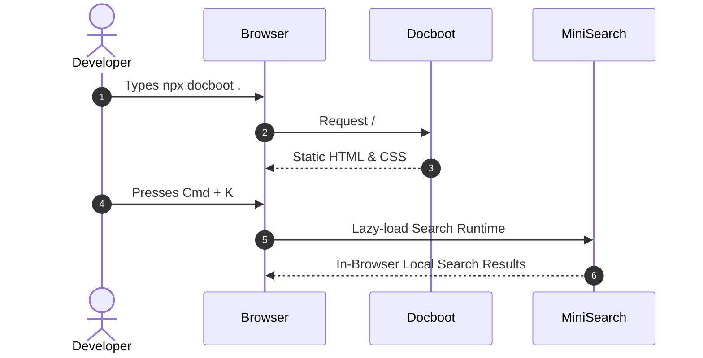

# Mermaid Diagrams

Docboot provides built-in, lazy-loaded **Mermaid** diagram support without plugins or extra configuration.

---

## 1. Flowchart Example

````markdown

````


---

## 2. Sequence Diagram Example

````markdown

````


---

## Features

- **Lazy Loading**: If a document contains no diagrams, Mermaid JavaScript is **never** downloaded.
- **Theme-Aware Rendering**: Diagrams automatically adapt to your active theme mode (`dark` / `light`) and re-render seamlessly when you toggle themes.
- **Interactive Modal & Pan-Zoom**: Hover over any diagram and click **Expand Diagram** to open a full-screen view with interactive pan and zoom controls for large architecture graphs.

---

## Next Steps

- [Local Search Architecture](/guide/search) — Client-side search indexing
- [Themes & Customization](/guide/themes) — Color presets and typography
- [Rich Content Primitives](/guide/rich-content) — Callouts, tabs, and details
