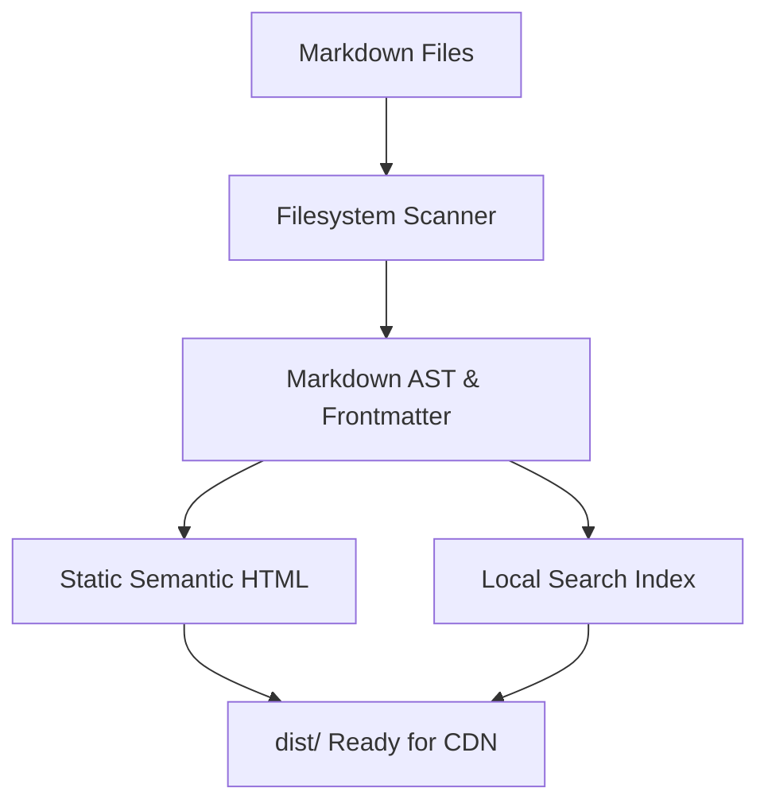
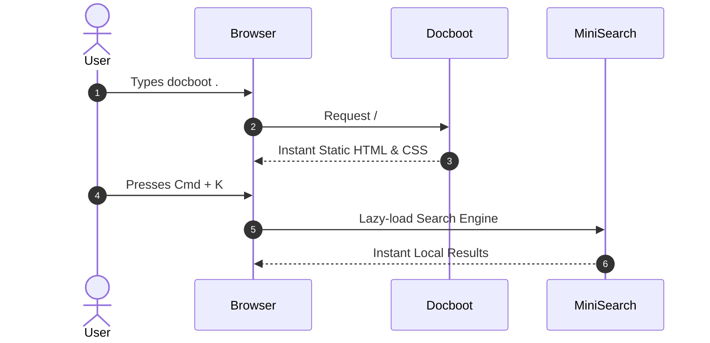

# Mermaid Diagrams

Docboot provides built-in, lazy-loaded **Mermaid** diagram rendering.

---

## 📊 Flowchart Example

---

## 🔄 Sequence Diagram Example

---

## 💡 How It Works
- **Lazy Loading**: If a page contains no Mermaid diagrams, **zero** Mermaid JavaScript is loaded (preserving ultra-lightweight page weight).
- **Dark & Light Mode Integration**: Diagrams automatically adapt to your active theme mode (`dark` / `light`) and re-render on the fly when switching themes.
